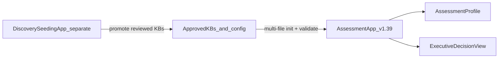
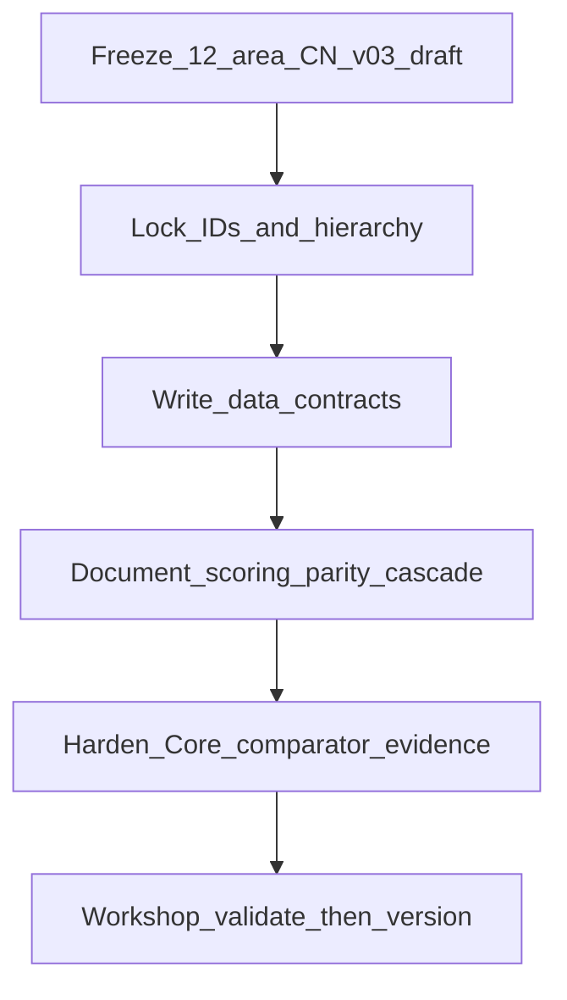

# VCF-AFA Handover + v1.39 Baseline Map

## Baseline rule (non-negotiable)

- **Only active implementation baseline:** VCF-AFA **v1.39**
- Source package: [`v1.39-BaselineRohitHandover/index.html`](v1.39-BaselineRohitHandover/index.html)
- Do **not** restart from older builds, revive failed UI/rendering experiments, or assume the old repository folder model is still active
- Future work starts from this package unless Keith explicitly directs otherwise

## Project purpose

Governed **advisory** app for customer workshops: capture requirements, compare a selected VCF baseline to platform-centric alternatives, evaluate functional parity with evidence, and produce executive shortlisting / feasibility outputs.

**Not:** lifecycle management, migration automation, generic product comparison, or vendor marketing.

## Architecture direction (logical layers)

| Layer | Role |
|---|---|
| Assessment app | Workshop capture, baseline/comparator selection, requirements, strategic considerations, scoring, EDV, exports |
| KB / config inputs | Approved VCF KBs, comparator KBs, Canonical Model, strategic list, rules/weights — explicit upload + validation |
| Discovery / Seeding app | **Separate** future app: discover versions, seed KBs, human review, promote assessment-ready files |

Assessment must **consume** approved KBs — not own automated discovery/evidence harvesting.

## What v1.39 already implements (code ↔ handover)

Present in [`index.html`](v1.39-BaselineRohitHandover/index.html) (~10.3k lines, single-file SPA + SheetJS):

- Active Data Mode + Demo Mode
- Executive Decision View (comparator viz, selection, color sync, VCF Baseline chip)
- AssessmentProfile save/export/import/resume
- Breadcrumbs, KB upload recognition, diagnostics, Ingestion Regression Guard
- Technical Requirements Capture, Strategic Considerations, Weighting, Post-Assessment Review
- Results / exports
- Executive-grade card styling across workflow screens
- Stable rendering: explicit hooks; no broad `setInterval` / persistent `MutationObserver` self-healers

**Code shape to respect when editing:** evolutionary patch layers. Later `<script>` blocks override earlier functions (`showPage`, exports, workflow pages). Prefer the **latest** override, not the first definition.

### Current page / flow map

Welcome → New/Resume preload → Assessment Basics → Strategic / Scope → KB + VCF baseline → Technical Requirements → Weighting / Review → Analysis → Results / EDV

Key DOM pages: `page-start`, preload pages, `page-profile`, `page-scope`, `page-kb`, `page-requirements`, `page-results`, plus JS-injected weighting/review steps. Placeholder admin: `page-toolConfig`, `page-promoteKb`, `page-versionDiscovery`.

## Comparator strategy

**Platform-centric**, not vendor-centric.

**Core (active focus):** VCF, NCP_AHV, AzureLocal, OpenShiftVirtualization, OpenStackKVM, ProxmoxVE

**Extended (later only):** XCPng, Harvester, HyperV, CitrixHypervisor, ScaleComputingHC3

Do not expand Extended until Core evidence is stable.

### Versioning principle

Support both:

- Single-product version basis
- Composite evaluation-period basis (e.g. OpenStackKVM Composite / `Q2-2026`)

Do not force every comparator into one version-number field.

## Canonical model (CN v0.3 — draft candidate)

Target scale: **~12 products/components × ~80 features × ~240 functionalities**

Customer-facing: Product/Component → Feature  
Scoring key: **Functionality_ID** (parity, evidence, aggregation)

Hierarchy: Platform → Domain → Capability → Feature → Functionality  
Score at Functionality, aggregate upward.

12 VCF areas stay as a **control mechanism** — do not inflate top-level categories; add-ons/integrations go in supporting structure.

## Parity and requirements

Parity: **Full / Partial / No**. Partial must carry workaround (availability, description, Low/Med/High complexity), impacts (technical/operational/commercial/sovereignty), notes, evidence.

Requirements: Capability / Feature / Functionality with cascade-down + lower overrides; effective requirement after resolution. Importance enums (Required / Important / Nice-to-have / Not required) should become configuration-governed.

## AssessmentProfile

First-class object: save, export, import, resume, multi-session continuity — customer context, VCF baseline, comparators, ratings/overrides, strategic/sovereignty/deployment, weights, notes, status, session metadata.

## Administration / Configuration (forward)

Expose feasibility rules, weightings, scoring, thresholds, importance mappings, comparator assumptions, aggregation, risk burden, strategic weighting. Repeatability is a governance requirement — same inputs → same results.

## UI / rendering guardrails

Executive-grade, calm, visible card boundaries, light fills, strong headers, clear technical vs strategic distinction. Visible improvements only.

Prefer: explicit render hooks, controlled nav/upload/change/click, render-signature guards, scroll preservation, scoped diagnostics.  
Avoid: broad MutationObservers, recurring self-healing loops.

## Demo vs Active

- **Active Data Mode** = production path / source of truth
- **Demo Mode** = permanent demo/storytelling path — must never corrupt Active behavior
- No feature that works only in Demo Mode

## Immediate recommended next steps (from handover)

1. Treat v1.39 as sole baseline (done for this package)
2. Confirm active source location / packaging (this handover folder + `index.html`)
3. Review Active + Demo behavior
4. Validate CN v0.3 (12/80/240) for workshop + scoring fitness
5. Confirm required multi-file initialization set + validation gates
6. Define comparator metadata for version vs evaluation-period
7. Draft Administration / Configuration page model
8. Prioritize Core comparator evidence mapping
9. Define Discovery↔Assessment data contract
10. Harden schema/validation before more comparators or UI features

## Explicit non-goals

No architecture restart; no older-version builds; no old-repo assumptions; no premature Extended comparators; no Demo-as-production; no permanently hidden scoring; no false single-version precision for composites; no invented parity; no discovery overbuild inside assessment; no over-granularized canonical model; no subtle-but-invisible UI “progress.”

## How to stabilize the model (practical path)

“Stabilize” means: same workshop inputs always produce the same defensible result, with a model that stays workshop-usable.

### Gap today vs target (v1.39 code)

- Scoring/matching is largely **FeatureID**-centric; target key is **Functionality_ID**
- Partial parity is often a near-match heuristic — missing rich workaround/impact fields
- Canonical Model (CN v0.3) is called out as future (“after Canonical Capability Model ingestion”)
- Rating weights / feasibility rules live hardcoded in JS (`RATING_WEIGHTS`, analysis logic)
- Init still mainly “upload KB xlsx set”; multi-file governed init (CN + rules + strategic list) not fully contracted

### Stabilization sequence

1. **Freeze CN v0.3 shape** — Keep the 12 VCF areas. Aim ~80 features / ~240 functionalities. Reject new top-level categories; put add-ons in a supporting structure.
2. **Lock IDs** — Every Functionality gets a stable Functionality_ID. Features/Capabilities map upward. Customer UI can stay Product → Feature; engine scores on Functionality_ID.
3. **Write data contracts** — Explicit required init files (VCF KBs, Core comparator KBs, CN file, strategic list, rules/weights). Schema for AssessmentProfile, KB tabs/columns, comparator metadata (single version **or** evaluation period like Q2-2026).
4. **Lock scoring rules on paper first** — Full / Partial / No parity definitions; Partial must include workaround + impacts; cascade from Capability → Feature → Functionality with overrides; weights and blocker rules documented so results are repeatable.
5. **Harden Core evidence only** — VCF, NCP_AHV, AzureLocal, OpenShiftVirtualization, OpenStackKVM, ProxmoxVE. Unknown > invented parity. No Extended comparators yet.
6. **Workshop-test, then version** — Run a real/sample workshop; trim or fill gaps; ship as next version (v1.40+) from v1.39 — no architecture restart.

### What not to do while stabilizing

No new platforms, no Discovery app inside Assessment, no Demo-only logic, no invisible UI tweaks as “progress,” no forcing composite platforms into a fake single version number.

### Suggested first executable slice

Pick one:

- **A.** CN v0.3 validation checklist + ID inventory against the 12 areas
- **B.** Init + AssessmentProfile + KB data-contract draft
- **C.** Scoring/parity/cascade rules sheet (then Admin page later)
- **D.** Core comparator evidence completeness matrix

## Bottom line

Stabilize by freezing the model shape, locking IDs and contracts, documenting scoring, and filling Core evidence — then version up from v1.39.

**Awaiting which slice (A–D) to execute first.**
